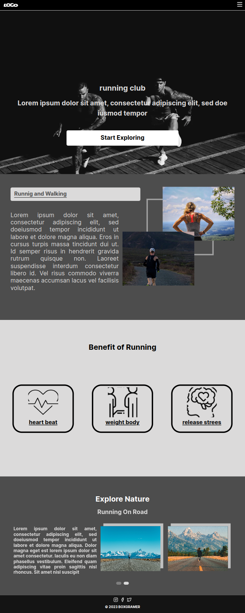
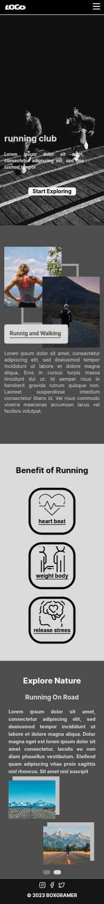

# Landing Page Template Built with NextJs 13+

this landing page is generated with next js, tailwind 3

# DEMO
- desktop <br/>
	
- mobile <br/>
	

checkout my <a hfref="">live demo </a>

# feature
- nextjs for static site generator
- integrated with Tailwind css
- using Typescript

# library
- use <a href="https://keen-slider.io/"> keen-slider</a>
- use <a href="https://github.com/pmndrs/zustand"> zustand </a>


# component 
- Header
- Info
- InfoGalery
- Landing
- SliderSection

# how to usage
- Header Component  
	```tsx
  <Header data={{logo: {src: image , alt: imgalt} ,menus: [
   {
     label : 'home',
     link  : '#'
   },
   {
     label : 'info',
     link  : '#'
   },
  ]}} />
	```
- Info Component
	```tsx
  const infoRef = useRef(null);
  const dataInfo= [
    {
      image: "/images/heart-beat.png",
      alt: "heart beat",
      title: "heart beat",
    },
    {
      image: "/images/bmi.png",
      alt: "bmi",
      title: "weight body",
    },
    {
      image: "/images/mental-health.png",
      alt: "mental health",
      title: "release strees",
    },
  ];


  <Info id={infoRef} data={dataInfo} />
	```
- InfoGalery 
	```tsx
  const infoRef = useRef(null);
  const infoGalery = {
    title: "Runnig and Walking",
    description:
      " Lorem ipsum dolor sit amet, consectetur adipiscing elit, sed do" +
      "eiusmod tempor incididunt ut labore et dolore magna aliqua. Eros in " +
      "cursus turpis massa tincidunt dui ut. Id semper risus in hendrerit " +
      "gravida rutrum quisque non. Laoreet suspendisse interdum consectetur " +
      "libero id. Vel risus commodo viverra maecenas accumsan lacus vel " +
      "facilisis volutpat. ",
    image1: {
      src: "/images/section_2_image_1.jpg",
      alt: "image section 2",
    },
    image2: {
      src: "/images/section_2_image_2.jpg",
      alt: "image section 2",
    },
  };
  <InfoGalery id={infoRef} data={infoGalery} />


	```
- Landing Component
	```tsx
  <Lading id="landing" data={{
     title : 'running club',
     description : ' Lorem ipsum dolor sit amet, consectetur adipiscing elit, sed do
            eiusmod tempor',
      button : {
        title : 'Start Exploring',
        link : '#'
      }
  }
  }/>
	```
- SliderSection
	```tsx
 	const slidereRef = useRef(null);
 	const dataSlider = [
    {
      title: "Running On Road",
      description:
        "Lorem ipsum dolor sit amet, consectetur adipiscing elit, sed do" +
        "eiusmod tempor incididunt ut labore et dolore magna aliqua." +
        " Dolor magna eget est lorem ipsum dolor sit amet consectetur." +
        " Iaculis eu non diam phasellus vestibulum. Eleifend quam" +
        " adipiscing vitae proin sagittis nisl rhoncus. Sit amet nisl" +
        " suscipit",
      image1: {
        src: "/images/section_4_image_1.jpg",
        alt: "image 1",
      },
      image2: {
        src: "/images/section_4_image_2.jpg",
        alt: "image 2",
      },
    },
    {
      title: "Running On Road 2",
      description:
        "Lorem ipsum dolor sit amet, consectetur adipiscing elit, sed do" +
        "eiusmod tempor incididunt ut labore et dolore magna aliqua." +
        " Dolor magna eget est lorem ipsum dolor sit amet consectetur." +
        " Iaculis eu non diam phasellus vestibulum. Eleifend quam" +
        " adipiscing vitae proin sagittis nisl rhoncus. Sit amet nisl" +
        " suscipit",
      image1: {
        src: "/images/section_4_image_2.jpg",
        alt: "image 1",
      },
      image2: {
        src: "/images/section_4_image_1.jpg",
        alt: "image 2",
      },
    },
  ];

  <SliderSection id={slidereRef} data={dataSlider} />

	```

### License Code

Licensed under the MIT License, Copyright © 2023

See [LICENSE](LICENSE) for more information.

### License Asset

- image  source from unsplash <a hfre="https://unsplash.com/license">click here for license </a>


